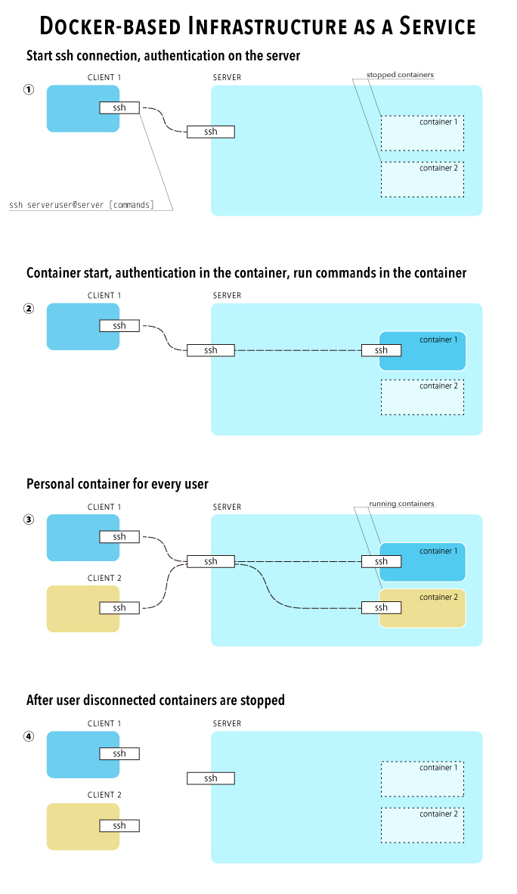

# Tools for creating a basic Infrastructure-as-a-Service (v3.2.26)

This is a set of bash-script files for creating a basic single-host IaaS on a Linux server. 
The purpose is to give every user a personal virtual machine in the form of a docker container (docker.com). Users’ containers can be built from any docker image. Users have root privileges inside their containers. User can change and save their container. 

Users are created on the server machine, every user is assigned one container. Service users are added to dockertest group. 
When a service user connects to the server with SSH he/she automatically logins into his/her container. It is absolutely seamless for users. 

Authentication is based on ssh-key and key forwarding. SSH-key authentication and key-forwarding for the server must be enabled on the user side. 

When host administrator creates a user, the following actions are performed:
* A user created on the host (server) and added to groups "dockertest" and "ssh". Every user of IaaS must be a member of "dockertest" group. "ssh" group can be used to restrict ssh login to the server only to this group members.
* A docker image for the user is built.


## Scheme



## Demonstration video

http://youtu.be/_SvzsBcp5wQ


## Set up on the server machine

SSH key forwarding must be enabled on the server. 
Force command must be set for dockertest group.
docker.sh file must be placed in the server root directory.

In /etc/ssh/sshd_config:

```
AllowAgentForwarding yes

Match Group dockertest
  ForceCommand /docker.sh
```

## SSH commands

There are special ssh commands, that when run from local computer will not be executed inside the user container but rather on the host. These commands are for manipulating user container.

### commit

Commit user container. The user's docker image is updated with the current container state.

### stop

Stop user container.

### remove

Remove user container. User's docker image is not removed, so when user logs in a new container will be created from user's docker image. 

### port

Display container ssh port number on the host side. Container must be running. 
Also port number is saved in SSH_PORT environment variable inside container. 

### freeport

Display free server port number. Can be used for creating ssh tunnel to container.

## In-container commands

### daemon

Enabling “daemon” mode. This command is to be called inside a container to prevent it from stopping when there are no active SSH connections.


### nodaemon

Command is to be called inside a container to turn off “daemon” mode: to set the container to be stopped after all SSH sessions are closed.


### stopnow

Command is to be run inside a container to stop the container immediately.


## Files


### cleanuser.sh

Removes user on the server and removes user's containers.


### createuser.sh

Creates user on the server and creates user's container, set up the server and container for automatic user login to container with SSH key. 

#### Arguments:
	user name
	docker image
	public key file
	
	
#### Requires:
	jq


### docker.sh

Is called every time user logs in with SSH to the host.
docker.sh starts user's container if it is stopped, creates SSH connection from the host to the container.

It must be placed in the host root directory. 

### container.sh

This file is called on every SSH connection to a container. It counts SSH connections and stops the container if there are no active connections and the container is not in “daemon” mode. 

### dockerwatch.sh

Called by container.sh and stop.sh to stop container in due time - when all active SSH connections to the container are closed.


### makeRemote.sh

Utility for mounting user local directories into user container on the server and executing commands inside the container. Must be executed on user local computer.

Usage: makeRemote.sh -u \<username> -h \<server address> -p \<local path to code> -k \<path to ssh-key> -m \<build command>

