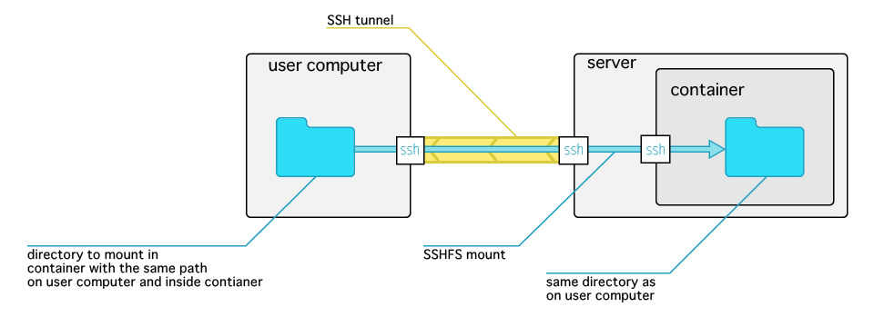

# Tools for creating a basic Infrastructure-as-a-Service

This is a set of bash-script files for creating a basic single-host IaaS on a Linux server. 
The purpose is to give every user a personal virtual machine in the form of a docker container (http://docker.com). Users’ containers can be built from any docker image. Users have root privileges inside their containers. User can change and save their container. 

Users are created on the server machine, every user is assigned one container. Service users are added to dockertest group. 
When a service user connects to the server with SSH he/she automatically logins into his/her container. It is absolutely seamless for users. 

Authentication is based on ssh-key and key forwarding. SSH-key authentication and key-forwarding for the server must be enabled on the user side. 

When host administrator creates a user, the following actions are performed:
* A user created on the host (server) and added to groups "dockertest" and "ssh". Every user of IaaS must be a member of "dockertest" group. "ssh" group can be used to restrict ssh login to the server only to this group members.
* A docker image for the user is built.

For installation and usage instructions see [Usage](#usage-instructions).


## Demonstration video

http://youtu.be/_SvzsBcp5wQ

# Usage instructions

## Setup on the server machine

Docker IaaS Tools provide installation and unistallation scripts for server-side setups.
To install run:
```
$ sudo ./install.sh
```
To uninstall:
```
$ sudo ./uninstall.sh
```
Both scripts provide detailed information on what is being done. 

## Creating new users

A new user is created with the following command:
```
$ sudo ./createuser.sh <username> <docker image name> <path to public ssh key> 
```
This will create a new user on the serve machine. When the new user will access the server with ssh he/she will be seamlessly redirected to a private Docker container created from the provided image. User must have his private ssh key saved in ssh agent with:
```
ssh-add <path to private ssh key>
```
SSH command should be:
```
ssh -A <username>@<server URL>
```

## Removing users

To remove a user and his/her container use:
```
$ sudo ./cleanuser <username>
```
on the server machine. 


## Mounting local directories in containers

It is possible to mount directories from user local computer into user container with the same path. [connect.sh](#connectsh) tool should be executed on user computer to mount local direcotory into container. 



Sample application of directories mounting: building source code in container for K-scope.
Demonstration:
http://youtu.be/86ybJdnNvUc

K-scope is a Java application for static and dynamic analysis of Fortran sorce code.   
K-scope is developed by RIKEN AICS Software Development Team.   
http://www.aics.riken.jp/ungi/soft/kscope/  
http://github.com/K-scope/K-scope

## SSH commands

There are special ssh commands, that when run from local computer will not be executed inside the user container but rather on the host. These commands are for manipulating user container.

### commit

Commit user container. The user's docker image is updated with the current container state.

### stop

Stop user container.

### remove

Remove user container. User's docker image is not removed, so when user logs in a new container will be created from user's docker image. 

### port

Display container ssh port number on the host side. Container must be running. 
Also port number is saved in SSH_PORT environment variable inside container. 

### freeport

Display free server port number. Can be used for creating ssh tunnel to container.

## In-container commands

### daemon

Enabling “daemon” mode. This command is to be called inside a container to prevent it from stopping when there are no active SSH connections.


### nodaemon

Command is to be called inside a container to turn off “daemon” mode: to set the container to be stopped after all SSH sessions are closed.


### stopnow

Command is to be run inside a container to stop the container immediately.


## Files


### cleanuser.sh

Removes user on the server and removes user's containers.

##### Sample usage:

```bash
sudo ./cleanuser.sh usernic
```


### createuser.sh

Creates user on the server and builds user's docker image, set up the server for automatic login into container with SSH key. 

##### Arguments:
	user name
	docker image
	public SSH key file
	
	
##### Requires:
	jq
    
##### Sample usage:

```bash
sudo ./createuser.sh usernic ubuntu:latest user_ssh_key
```

### docker.sh

Is called every time user logs in with SSH to the host.
docker.sh starts user's container if it is stopped, creates SSH connection from the host to the container.

It must be placed in the host root directory. 

### container.sh

This file is called on every SSH connection to a container. It counts SSH connections and stops the container if there are no active connections and the container is not in “daemon” mode. 

### dockerwatch.sh

Called by container.sh and stop.sh to stop container in due time - when all active SSH connections to the container are closed.


### connect.sh

Utility for mounting user local directories into user container on the server and executing commands inside the container. Must be executed on user local computer.
Whithout remote command can be used to login to the container with X11 forwarding. This makes possible to use GUI applications inside the container. 

Usage: ```connect.sh -u <username> -h <server address> -p <local directory to mount> -i <path to ssh-key> -m <remote command>```

##### Requires:
	SSHFS in container 
